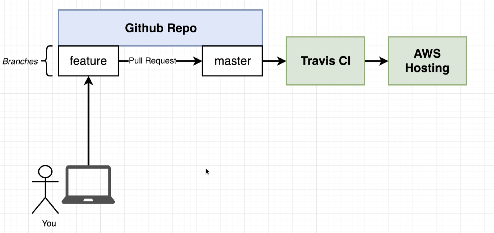

# The project

The focus of this project is to build a production-grade workflow with Docker, Travis CI, and AWS.

Made as part of the 'Docker and Kubernetes: The Complete Guide' course on Udemy by Stephen Grider.

## For development, run
    docker build . -f Dockerfile.dev
    docker run -p 3000:3000 -v /app/node_modules -v $(pwd):/app <image_id>

OR just
    
    docker-compose up (might need --build for the first time)

## Testing
    docker run -it <image-id> npm run test

OR better yet, assuming we have only the 'web' service, in order to e.g. live update tests

    docker-compose up
    docker ps (to get the container id)
    docker exec -it <container-id> npm run test

OR, assuming we have the 'tests' service, but without being able to
send input to the testing interface

    docker-compose up
    however, we can use
    docker exec -it <container-id of tests> sh
    npm run test

## For production env
    docker build .
    docker run -p 8080:80 <image-id>