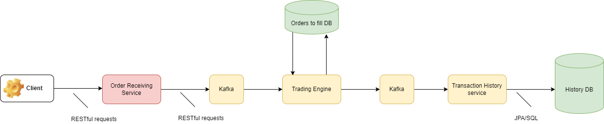

# Order Matching System / Assets Exchange

## Overview

### ! Work in Progress !

A simple assets exchange platform designed with a microservices architecture in mind. Clients can create buy and sell orders, and the application matches these orders.

As an example, this is how a sell order would be represented:

```
{
    "order_id": "sell_1",
    "type": "sell",
    "currency": "USD",
    "limit_price": "10",
    "num_contracts": "2",
    "remanining_contracts": "1",
    "matches": [
        {"order_id": "buy_1", "contracts": "1"}
    ]
}
```

The RESTful API server enables CRUD operations on orders and related resources. Clients should be able to use the following HTTP verbs: GET, HEAD, POST, PUT, PATCH, DELETE, OPTIONS.

Currently, the application supports GET requests for retrieving all orders and POST requests for submitting new orders. Also, the current architecture has not yet been decomposed into microservices.

## Technologies

Technologies that have been used so far:
- Java 19, Spring Boot

Planned integrations:
- Redis as a data store for unfulfilled or partially filled orders.
- Kafka as a message queue to address possible congestion. It should sit between the order receiving service and the order processing service (i.e. Trading Engine). This would decouple these services allowing them to scale independently, provide fault tolerance by ensuring that messages are not lost in case of failures in the processing service and allow it to catch up with a backlog of orders in case of congestion.
- PostgreSQL to store transaction history.
- Docker, Kubernetes, Terraform for AWS, a CI/CD config probably for Jenkins.

## Architecture
### Current state


### Planned Architecture for the very near future


## Features to be added:
In order of estimated difficulty and order of implementation:
- Order cancellation. In other words, a client should be able to delete a submitted order.
- Support different type of assets. Each asset should have a ticker symbol and available quantity.
- Handle different types of orders, such as market orders, limit orders, and stop orders.
- Create a user management system to handle user authentication, authorization, and user-related data such as portfolios and transaction history.
    - As part of this, a client should be able to delete an order that they submitted and not those submitted by other clients.