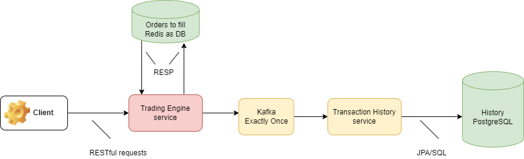

# Assets Exchange Platform

## Overview

### ! Work in Progress !

A simple assets exchange platform designed with an event-driven microservices architecture in mind. Clients can create buy and sell orders, and the application matches these orders.

The RESTful API server enables CRUD operations on orders and related resources. Clients should be able to use the following HTTP verbs: GET, HEAD, POST, PUT, PATCH, DELETE, OPTIONS.

Currently, the application supports GET requests for retrieving all orders and POST requests for submitting new orders. Also, the current architecture has not yet been fully decomposed into microservices.

As an example, this is how a sell order that would be sent by a client look like in the body of a POST:
```
{
    "side": "SELL",
    "type": "LIMIT",
    "numContracts": 2,
    "limitPrice": 10,
    "currency": "USD"
}
```

And this is how it might be represented internally (i.e. by the `Order` class in the `common` package):

```
{
    "order_id": "sell_1",
    "type": "sell",
    "currency": "USD",
    "limit_price": "10",
    "num_contracts": "2",
    "remanining_contracts": "1",
    "matches": [
        {"order_id": "buy_1", "contracts": "1"}
    ]
}
```

## Technologies

Technologies that have been used so far:

- Java 19, Spring Boot + Data + Cloud, Gradle, Groovy, Spock, Hibernate, PostgreSQL ([starter script here](https://github.com/Gabighz/learning-stuff/blob/master/Java/AssetsExchange/exchangeassets/transaction-history/src/main/resources/starter.sql)), Redis (with Redisson), Kafka

### Justifications

- Kafka is used as a message queue to address possible congestion. It should sit between the services, with a topic from the order-receiving-service to the trading-engine and another topic for trading-engine to transaction-history-service. This decouples these services, allowing them to scale independently, provide fault tolerance by ensuring that messages are not lost in case of failures in the processing service and allow it to catch up with a backlog of orders in case of congestion. Lastly, from my experience and from a development perspective, it is **a lot** easier to have it for communication between services than Eureka + Feign (used in previous iterations).
- Redis is used as a primary in-memory database for to-be-filled orders. Given that orders, in a hypothetical scenario, would come and go really fast, its low-latence and high throughput makes it suitable for this. Persistance is traded-off for speed. The default persistance option is used: RDB persistence with snapshots every 15 minutes.

Planned integrations / tech stack improvements:

- An observability stack.
- Sharded PostgreSQL cluster.
- Sharded Redis cluster.
- A production-grade multi-broker Kafka cluster (current replication factor is 1)
- Infrastructure-related: Nginx, Docker, Kubernetes, Terraform for AWS, a CI/CD config probably for Jenkins.

## Usage
The following API endpoints are available on the current implementation:

- `/orders` (GET): 
    - Get all orders.
- `/orders` (POST): 
    - Submit an order.
- `/orders/{id}` (DELETE):
    - Deletes a not-fulfilled order

For a more formal description, the OpenAPI 3.0 specification at [exchangeassets/trading-engine/openapi.yml](https://github.com/Gabighz/learning-stuff/blob/master/Java/AssetsExchange/exchangeassets/trading-engine/openapi.yml) can be used.

## Architecture
### Current state


### Planned Architecture for the very near future


## Features to be added:
In order of estimated difficulty and order of implementation:

- Support different type of assets. Each asset should have a ticker symbol and available quantity.
- Handle different types of orders, such as market orders, limit orders, and stop orders.
- Create a user management system to handle user authentication, authorization, and user-related data such as portfolios and transaction history.
    - As part of this, a client should be able to delete an order that they submitted and not those submitted by other clients.

## A history of iterations

Started on Mar 17, 2023 with basic initial setup (commit 2274707).

First 'major version': Apr 4, 2023 (commit 2511400)
