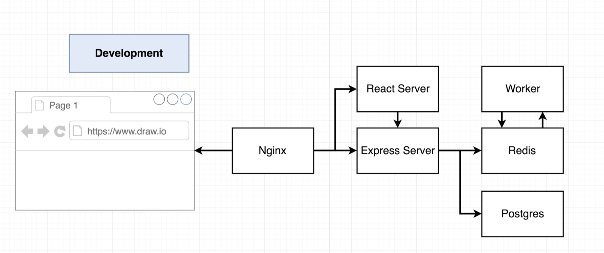
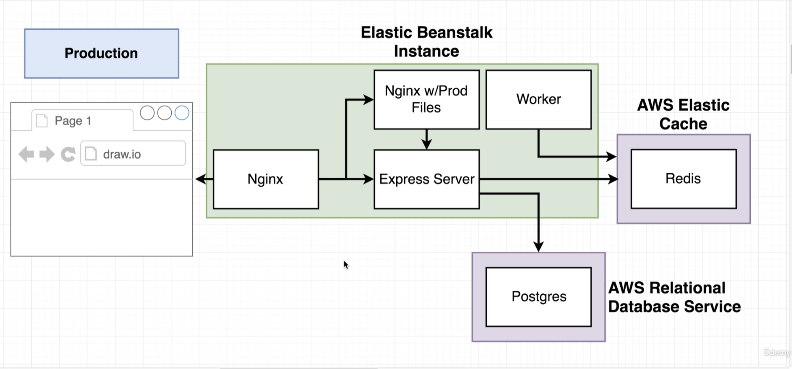
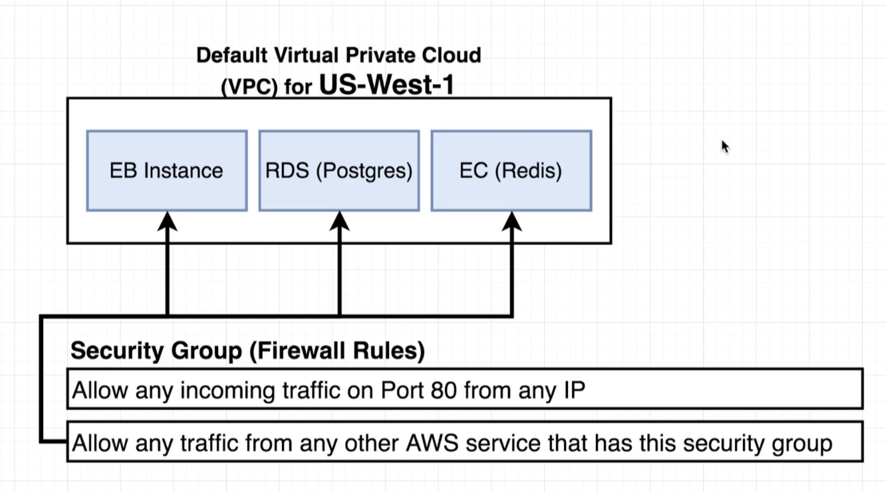
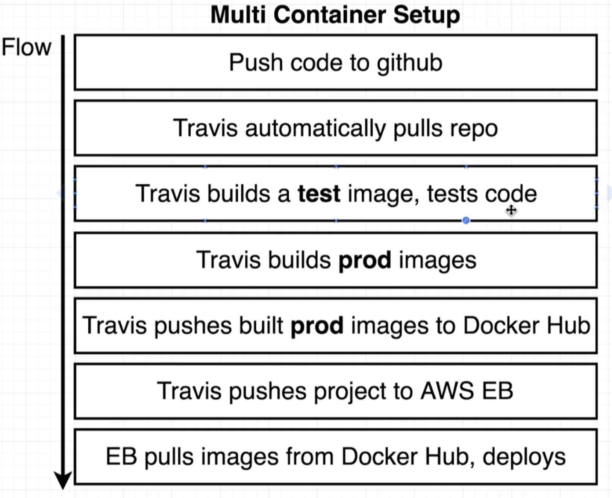

# Fib calculator

Made as part of the 'Docker and Kubernetes: The Complete Guide' course on Udemy by Stephen Grider.

An over-engineered fib calculator made for the sake of learning about
multi-container apps.

### App architecture:

### CI/CD pipeline:

## For development, run
    docker-compose -f docker-compose-dev.yml up --build