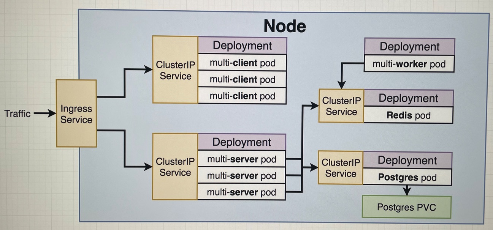
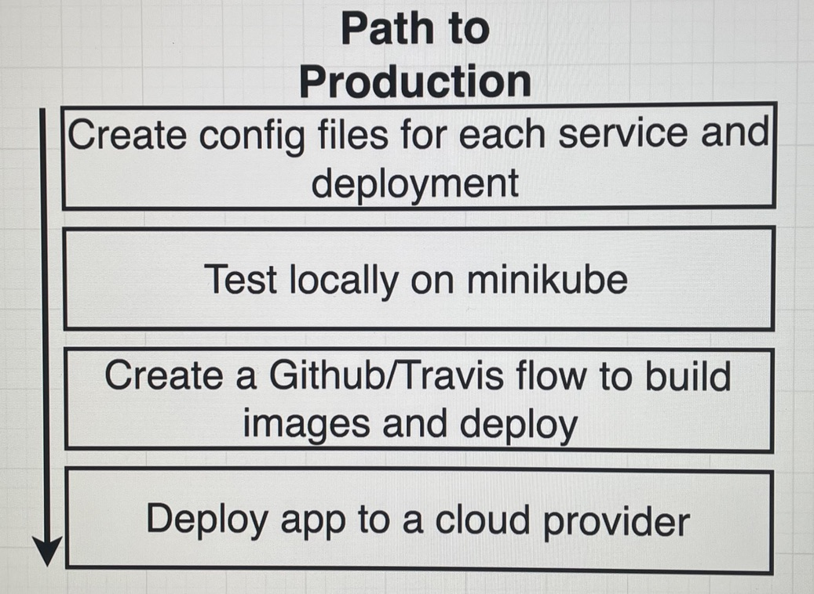
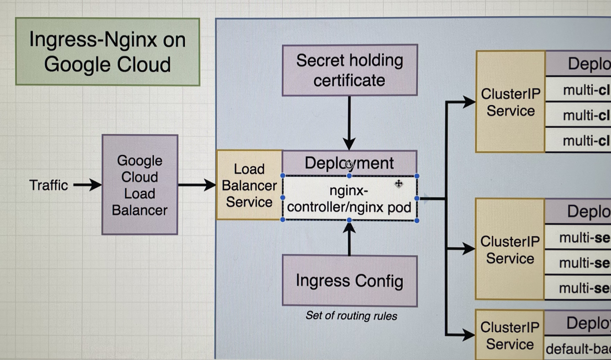

# A bit more complex k8s project

Production-grade K8s version of:
https://github.com/Gabighz/learning-stuff/tree/master/infrastructure/docker/complex

# Local dev

    minikube start --driver=hyperkit
    kubectl apply -f k8s

After running the above commands, the app can be visited in your local browser at the IP that's output by 'minikube ip'.

Or to use Skaffold, to watch for changes in the React code, in the mode of injecting them into the appropriate pods (super cool):

    skaffold dev

# CI/CD with Travis to GCP
- Have this project in its own github repo and enable Travis for it
- In your GCP Console:
    - Initialize a Kubernetes Cluster
    - Create a service account (e.g called travis-deployer) with a Kubernetes Engine Admin role.
    - Create a key for this service account and download it as a JSON
    - Rename this JSON file to service-account.json and put it in this project's folder.
- Back to your machine, download and install the Travis CLI
    - To do so in the most convenient way, run:

            docker run -it -v $(pwd):/app ruby:2.4 sh
            gem install travis

- Encrypt and upload the json file to our Travis account
    - Note: In travis.yml, we have code to unencrypt the json file and load it into the GCloud SDK
    - Within the aforementioned container with travis:

            travis login --github-token YOUR_PERSONAL_TOKEN --com
            travis encrypt-file service-account.json -r USERNAME/REPO --com

    - Note: **Closely** follow the instructions output by this command, including replacing the openssl line in travis.yml with the one that's been generated for you. At this point, to not make a mistake, you may delete service-account.json before pushing.

- In travis.yml, deploy.sh, and the k8s Deployment files, replace the relevant variables (e.g. docker username) with your appropriate values. Also make sure you have added DOCKER_USERNAME and DOCKER_PASSWORD as env variables on travis-ci.org

- Create a Secret on GCP by accessing the Cloud Shell of your GCP project and run:

        gcloud config set project YOUR_PROJECT_NAME
        gcloud config set compute/zone YOUR_CLUSTER'S_LOCATION
        gcloud container clusters get-credentials YOUR_CLUSTER'S_NAME
        kubectl create secret generic pgpassword --from-literal PGPASSWORD=12345

- Still within the Cloud Shell, install Helm and Ingress-Nginx:

        curl -fsSL -o get_helm.sh https://raw.githubusercontent.com/helm/helm/master/scripts/get-helm-3
        chmod 700 get_helm.sh
        ./get_helm.sh
        helm repo add ingress-nginx https://kubernetes.github.io/ingress-nginx
        helm install my-release ingress-nginx/ingress-nginx

- At this point, you can visit your app by visiting the IP address of the ingress-nginx-controller displayed under 'Endpoints' in the Services & Ingress tab. Fun fact: you can also find it at 'Load Balancing' under 'Network Services' in the Networking products (not specifically related to k8s)

Using commit SHAs when building our docker images has two benefits: allows us to imperatively update the images used by k8s and allows us to know (and possibly debug with a git checkout) the exact code that's running in production. We're tagging with latest too so that the config files can be applied anytime without worrying about a specific SHA.

### HTTPS Setup with K8s

- Get a domain from domains.google.com
    - Then assign record A with name @ to be the IP address of the load balancer and CNAME with name www the name of your domain
- Install Cert Manager to your K8s cluster:

        helm repo add jetstack https://charts.jetstack.io
        helm repo update
        helm install \
        cert-manager jetstack/cert-manager \
        --namespace cert-manager \
        --create-namespace \
        --version v1.8.0 \
        --set installCRDs=true

    - Check if it worked with:

            kubectl get certificates
            kubectl describe certificates
            kubectl get secrets (there should be one called yourdomain-com of type kubernetes.io/tls)

- After getting the certificate, copy the contents of k8s-https to k8s, accepting overwrites, then push the new changes to origin.

# Other personal notes

## Misc new commands being used vs simplek8s:
Load multiple config files:

    kubectl apply -f k8s

Get logs:

    kubectl logs <pod-name>

Access minikube's cool dashboard:

    minikube dashboard

## New objects being used vs simplek8s:
- **ClusterIP** = Exposes a set of pods to other objects in the cluster (would be otherwise inaccessible); does not allow traffic from the outside world
- **Ingress** = Exposes a set of services to the outside world (supposedly better than LoadBalancer). Specifically going to use [ingress-nginx](http://github.com/kubernetes/ingress-nginx) for this project.
- **Secret** = Securely stores a piece of information in the cluster, such as a database password

## Postgres PVC
Postgres, unlike redis which is an in-memory data store, stores data in a filesystem.

To have a consistent filesystem across pods with such databases, we need a Persistent Volume Claim to carry data over to a new pod that contains a postgres container, for example, in case the one we were using crashes and was deleted by Deployment. We really don't want loss of data on any database such as postgres.

This volume is on the host machine and is outside the postgres container(s). Postgres writes to / reads from this volume. Although, these replicated databases must be aware of each other, otherwise it's a recipe for disaster.

Volume in generic container terminology: Some type of mechanism that allows a container to access a filesystem outside itself.

Volume in K8s: An **object** that allows a container to store data at the pod level. Useful if we're expecting that a container within a pod might crash and we're ok if data is lost when the pod would be deleted.

Persistent Volume: Long-term durable storage that's separate from any pod. (like a store room - statically provisioned)

Persistent Volume Claim: Storage options that a pod would have access to in a particular cluster (like a billboard that advertises what the store room should have; if the store room doesn't have it on hand, it fabricates it on the fly - dynamically provisioned)

Can use the following commands to see more information about where and how would volumes be dynamically provisioned:

    kubectl get storageclass
    kubectl describe storageclass

In the case of local dev, a slice of the hard drive would be claimed. On a cloud provider, by default, Google Cloud Persistent Disk, Azure File/Disk or AWS EBS would be used.

Get info about present persistent volumes and claims:

    kubectl get pv
    kubectl get pvc

## Creating a Secret object
Not using a config file because it would defeat its purpose, so we do it imperatively like this:

    kubectl create secret <type_of_secret> <secret_name> --from-literal (as opposed to from file) key=value

More concretely for this project:

    kubectl create secret generic pgpassword --from-literal PGPASSWORD=12345

Get info about present secrets:

    kubectl get secrets

## Ingress Service
The ingress controller can be installed through minikube's addon system:

    minikube addons enable ingress

or with Helm:

    helm upgrade --install ingress-nginx ingress-nginx \
    --repo https://kubernetes.github.io/ingress-nginx \
    --namespace ingress-nginx --create-namespace

or without Helm (also visiting the link in a browser is useful to find out more):

    kubectl apply -f https://raw.githubusercontent.com/kubernetes/ingress-nginx/controller-v1.3.0/deploy/static/provider/cloud/deploy.yaml

## Misc notes
- We could combine the contents of any config files, separating them with '---', but we consider it's more maintainable and readable to keep them in the current separation.
- Keep in mind that the worker is the slowest component in our app (does the fib calcs) and might need to scale out and have multiple instances.
- Currently using one redis server, but we can set it up in cluster mode, where there are multiple copies of redis that communicate with each other and enhance overall stability and throughput. Same goes for postgres.

### Diagrams

### Instead of using Travis, we can use Github Actions with AWS as such:
